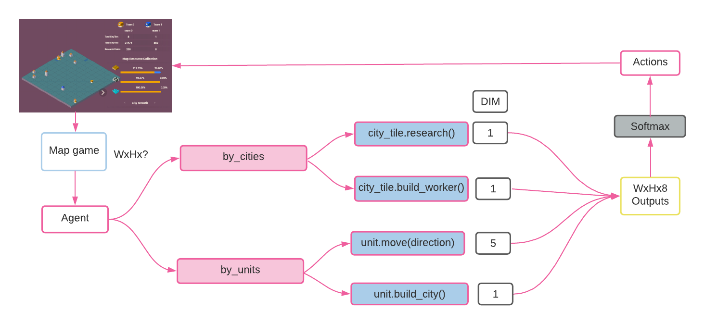
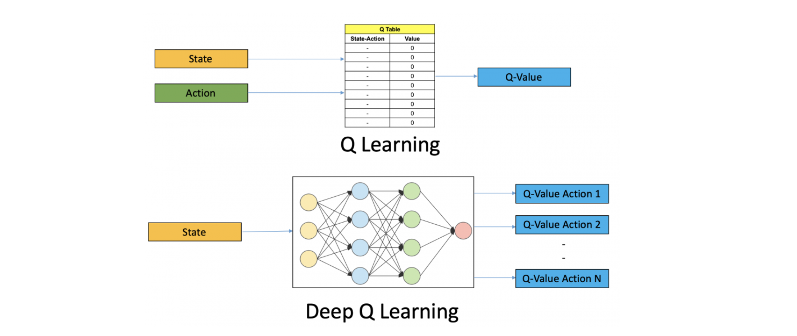

### [Lux AI Kaggle competition](https://www.kaggle.com/c/lux-ai-2021) solution using reinforcement learning

# Model inputs & outputs flow

<!-- Gather the most resources and survive the night! -->

<!--  -->

# kaggle kernels
-  [Notebook 1 : Train model on many scenarios of an agent who follow deterministic strategy](https://www.kaggle.com/aithammadiabdellatif/lux-ai-dl-learn-the-strategy)

-  [Notebook 2 : Enhance the model using reinforcement learning](https://www.kaggle.com/aithammadiabdellatif/keras-lux-ai-reinforcement-learning)

# Approach

In notebook 1 we tackle the following steps:
- [x] Making a deterministic agent play many episodes and save them. ([Agent source code](https://github.com/aaiit/lux-AI/tree/main/Game))
- [ ] Scaling inputs
- [x] Define data generator
- [ ] Radom fliping augmentation
- [x] Define custom loss 
- [ ] Evaluations metrics.
- [x] Define the model.
- [x] Train the model.

In notebook 2
- [ ] Enhance the model using reinforcement learning.

# Challenges
- The map take different shapes
- Maintaining exploration 

# Loss
The loss is based on MSE to be suited to game task

<!--  \sqrt{ \frac{1}{N_{units} }\sum_{i \in units } Y^{units}_i - \bar{Y^{units}_i}} + \sqrt{ \frac{1}{N_{cities} }\sum_{i \in cities} Y^{cities}_i -\bar{Y^{cities}_i}} -->

<!--  -->

# Ressources
- [Reinforcement Learning: An Introduction
 (MIT Press, Cambridge, MA, 2018)
](http://incompleteideas.net/book/the-book-2nd.html)

